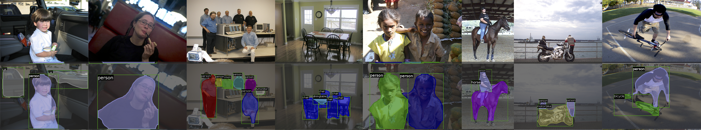
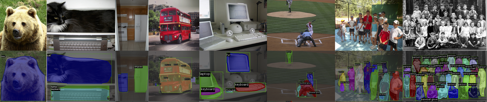

# RLS
Reformulating Level Sets as Deep Recurrent Neural Network Approach to Semantic Segmentation

Ngan Le, Kha-Gia Quach, Khoa Luu, Marios Savvides, Chenchen Zhu

### Introduction

This is the repository for Recurrent Level Sets (RLS). An arxiv tech report describing FCIS is available. [here](https://arxiv.org/abs/1704.03593).

If you find RLS useful for your research, please consider citing

@article{le2017reform,
Author = {Le, Ngan and Quach, Kha-Gia and Luu, Khoa and Savvides, Marios and Zhu, Chenchen},
Title = {Reformulating Level Sets as Deep Recurrent Neural Network Approach to Semantic Segmentation},
Journal = {arXiv preprint arXiv:1704.03593},
Year = {2017},
Publisher = {arXiv}
}

### Resources

0. Code of RLS is coming soon!
